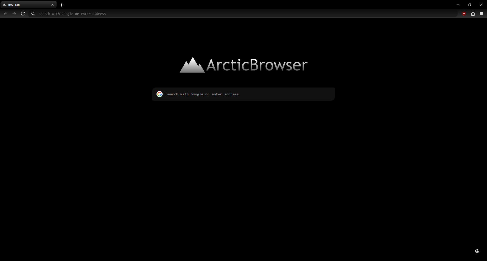

# ArcticBrowser - The most funny Firefox mod ever.

# Some reviews from epic gamerz

<ul>
    <li>"This mod sucks ass" - VeltrixDev, 0/5 stars</li>
    <li>"The. Arctic." - Sunburst Pep, 5/5 stars</li>
    <li>"yes" - Kyros, 5/5 stars</li>
</ul>

# how to install!?

<ol>
    <li>Download the stupid zip file</li>
    <li>Extract the zip file</li>
    <li>If Firefox is open, go to "about:profiles" and then open any profile folder you want</li>
    <li>Copy the "user.js" file and the "chrome" folder and paste them into the profile folder</li>
    <li>Restart Firefox if it's open</li>
    <li>You are done!!111 Enjoy the funny product.'</li>
</ol>

# Additions

On Windows, you can change the Firefox icon and name. Idk about Mac and Linux srry.